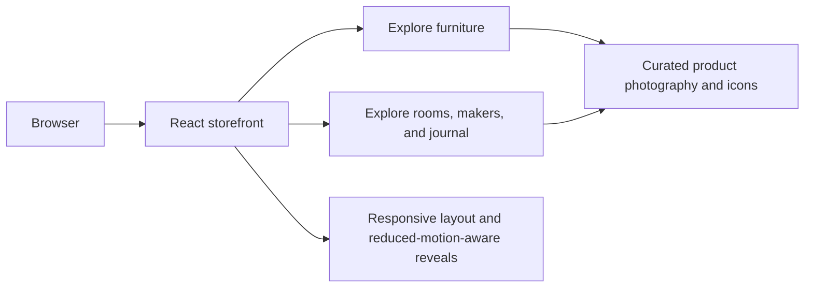

<h1 align="center">Meridian</h1>

<p align="center"><em>Slow furniture for modern living.</em></p>

<p align="center">
  
</p>

<p align="center">
  
  
  
  
</p>

Meridian is a responsive, editorial-style furniture storefront landing page. It brings together a curated collection, room photography, material and maker stories, customer quotes, and a journal in one scrollable experience.

> **Scope:** This repository contains the storefront interface and its static assets. It does not include a product API, checkout, account service, or newsletter backend.

## Experience map



## Highlights

- **Curated furniture:** category cards and featured product listings.
- **Room inspiration:** editorial room photography with featured product callouts.
- **Brand storytelling:** materials, makers, customer quote, and journal sections.
- **Responsive presentation:** layouts adapt across desktop, tablet, and mobile widths.
- **Motion with a fallback:** scroll reveals and parallax effects respect the reduced-motion preference.
- **Bundled imagery and icons:** the visual assets live in `public/assets`.

## Get started

The toolchain is pinned in `.mise.toml` (Node.js 22 and pnpm 10.34.3).

```sh
pnpm install
pnpm dev
```

Vite prints the local development URL when the server starts.

## Checks and build

```sh
pnpm exec tsc --noEmit
pnpm build
pnpm preview
```

`pnpm build` writes the production site to `dist/`; `pnpm preview` serves that build locally.

## Project structure

```text
src/
  App.tsx       Page sections and content
  index.css     Responsive styling, typography, and motion
  main.tsx      React entry point
public/
  assets/       Product, room, editorial, and icon assets
.figma/
  make/         Site metadata and Figma Make tooling
```
